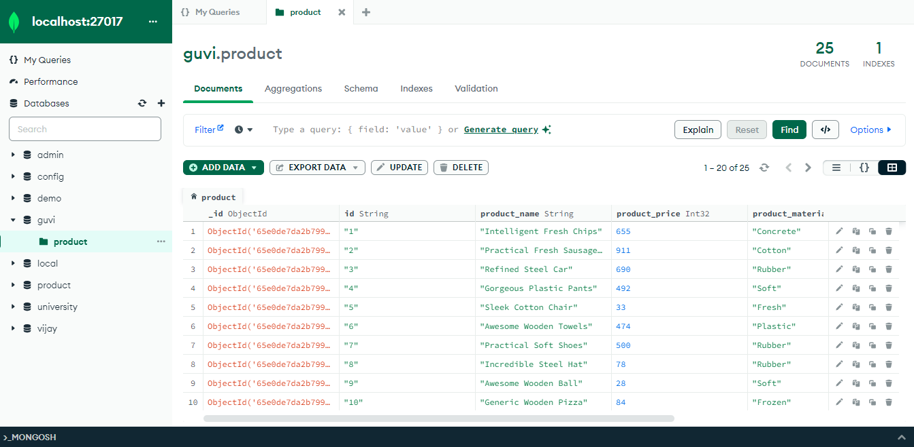

# MongoDB-Task1

It has Guvi-Zen class Roadmap session: Day-33 and Database : Day-1 Task. In this task, I worked on various Mysql queries which helped me to understand how the relational database works.

## Lessons Learned

- Create database and collections
- CRUD Operations
- countDocuments
- Comparison Operators
- limit()
- count()
- Projection
  

## Screenshots

## Feedback

If you have any feedback, please reach out to me at vijaymayhul@gmail.com
